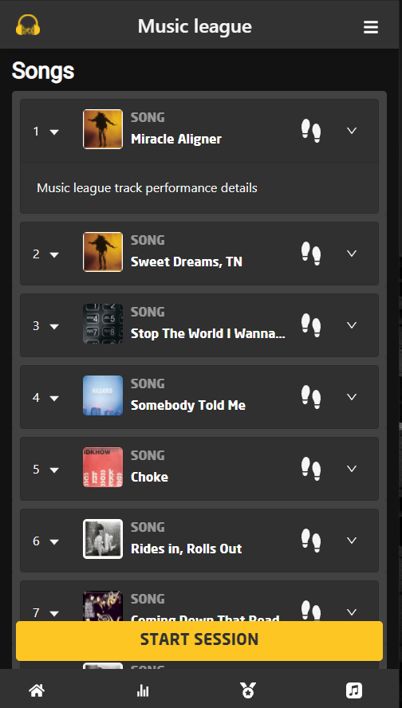
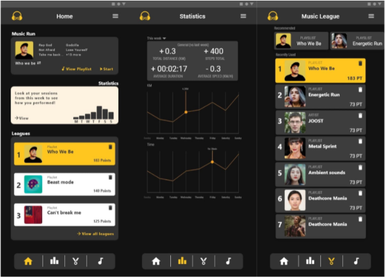

# Music-league
## Introduction 
Tijdens dit project heb ik samen met Joep, Bram, Jop en Houssem gewerkt aan Music league. Music league is een onderdeel van het concept van de opdrachtgever. Music league houd het volgende in: de gebruiker gebruikt de app om te rennen op muziek. De app registreert vervolgens op welke muziek de gebruiker beter of slechter rent. De betere muziek wint in de “music league” en blijft in de lijst staan. De muziek die de gebruikers prestaties verslechteren worden uit de lijst verwijderd. Een AI houd dit alles in de gaten en kan op basis van de goede nummers nieuwe soortgelijke nummers aan de lijst toevoegen die op hun beurt weer winnen of verliezen in de music league. Samen met Joep heb ik gewerkt aan het grafisch vormgeven en realiseren van de music league. En verder na te denken over dit concept om eventuele nieuwe features te bedenken en te realiseren.  

## Install music league
To install music-league locally use npm install.
To use spotify a client id and client secret are needed these can be retrieved from https://developer.spotify.com/dashboard. The same goes for the Auth0 domain and client id which can be retrieved from https://manage.auth0.com/dashboard under the application settings, make sure to use the right redirect urls. The credentials are stored in a .env file.   

## How to use spotify 
When a client id and secret are provided one can log in on spotify to get his own spotify auth token which is saved in the cookies. However, this will only work if the right redirect urls are set in the spotify developer tool and the App.js. When more scopes need to be applied this can also be done in de App.js.
To get data from the API Axios has been used to send requests. These requests can be found easily on https://developer.spotify.com/documentation/web-api/reference/.
Keep in mind that in the development stage people have to also be added to the spotify developer tool (https://developer.spotify.com/dashboard/applications/*ApploicationId*/users) in order to be authorized to get data, for this a name and the spotify user email is needed. When all of the above steps a completed the app should be good to go.  

## Future recomendations
Future steps in this project would be first of all to implement the designs fully in react. Besides that the app now contains the basic connections and workflow on which new features and details can be build. So the future steps would be to write the logic needed for the app to function. The workflow that isn't implemented yet is the edditing and creating of new playlits/leagues this feature will have to be researched and build.   

## The app

## The designs

## Usage
bootstrap
Axios
React icons 
js cookie

## Lisence
[MIT](https://choosealicense.com/licenses/mit/)

